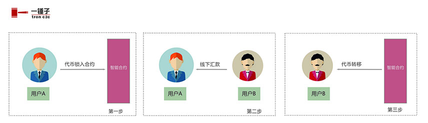
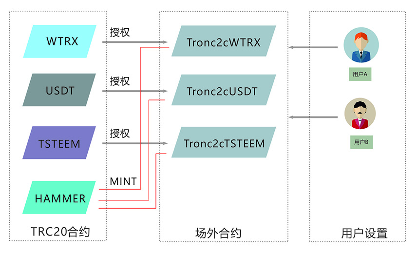

# 一锤子白皮书

## 目录

- [一. 概述](#一-概述)
- [二. 目的和作用](#二-目的和作用)
- [三. 基本实现过程](#三-基本实现过程)
- [四. 使用的区块链](#四-使用的区块链)
- [五. 智能合约的实现](#五-智能合约的实现)
- [六. 数据的结构](#六-数据的结构)
- [七. 订单的状态](#七-订单的状态)
- [八. 支持的币种](#八-支持的币种)
- [九. 奖励机制](#九-奖励机制)
- [十. HAMMER说明](#十-hammer说明)
- [十一. 订单的有效期](#十一-订单的有效期)
- [十二. 付款和确认的有效期](#十二-付款和确认的有效期)
- [十三. 订单的索引时限](#十三-订单的索引时限)
- [十四. 隐私](#十四-隐私)
- [十五. 恶意行为](#十五-恶意行为)
- [十六. 信任名单机制](#十六-信任名单机制)
- [十七. 结论](#十七-结论)


## 一. 概述
中心化交易所的弊端丛生：比如跑路了、任意冻结用户资金、使用用户资金砸盘、超发假币...... 我们已经忍受它们够久了，是时候有所改变了。

Uniswap开启了去中心化交易的先河！我们发现，除了中心化的交易所，我们还有另一条路可选，这是多么美好地一件事！一时之间，开启了去中心化的热潮。

作为重要的出入金的通道，可不可以去中心化呢？换句话说，能用智能合约来做场外吗？

也许值得尝试。没有了中心化的弊端，去中心化的场外显得轻巧任性。也许也会有风险，但走出第一步是必要的。一锤子在这方面做了些尝试，效果还不错。

去中心化是一个更友好更易于让人接受的范式，在现在和未来都将大放光彩！

## 二. 目的和作用
**一种可依赖的场外交易规则**，如果用一句话来概括一锤子的作用，我想就是这句了。在智能合约所制订的规则面前，人人平等。没有第三方的干扰和介入，用户的阻力会降低很多，体验感也会加强。苦于中心化的弊端太久，是时候做些改变和尝试了。

一切都要依合约来进行！一锤子在很大程度上解决了中心化的问题，在规则上也尽量体现出公平公开的原则。它建立在波场区块链上（同时也会在以太坊上），任何人都可以自由地使用，而没有复杂的审核和限制。在很多方面，一锤子是一个开放流通的世界！

不管你是普通用户还是开发者，一锤子都可以在场外上提供一些解决方案。针对所有可能出现的状态，一锤子的场外合约都做了相应地针对，整体设计得还是比较精密的。

## 三. 基本实现过程
一锤子（tronc2c）致力于去中心化的场外交易。交易的基本过程主要是三步，第一步：将代币锁入合约；第二步：线下汇款；第三步：代币转移。如下图所示：




## 四. 使用的区块链
一锤子现已建立在波场(TRON)区块链上，同时也会建立在以太坊区块链上。

官网(波场版)： https://tronc2c.com

## 五. 智能合约的实现
相应的代币在对应的合约中实现场外交易，例如：`WTRX`在 `Tronc2cWTRX.sol`实现场外交易，其规则可参看相关合约。

代币合约和相应的场外合约的关系如下图所示：



## 六. 数据的结构
订单的数据都存储在名为`orders`的`mapping`表中，通过`id`的自增不断新增，也通过`id`来查询订单。订单的结构如下所示：
```js
struct OrderMessage
    {
        uint256 orderNumber;
        uint256 amount;
        uint256 price;
        bool    isTrust;
        address seller;
        address buyer;
        uint256 submitTime;
        uint8   numberOfRounds;
        State   state;
    }
mapping(uint256 => OrderMessage) public orders;    
```


## 七. 订单的状态
以订单的状态变化来标记买卖双方的进程。订单的状态如下所示：
```js
 /*卖单状态
    卖家发布卖单   SellerCreated
    卖家暂停卖单   SellerSuspend 
    卖家取消卖单   SellerCancelled
    卖单超时赎回   SellerRedeem

    买家提交买单    BuyerSubmit
    买家确认付款    BuyerConfirmPayment

    卖家确认收款   SellerConfirmReceive
    卖家超时未确认 SellerOutofTime
    */
    enum State {SellerCreated,
                SellerSuspend,
                SellerCancelled, 
                SellerRedeem, 
                BuyerSubmit, 
                BuyerConfirmPayment,
                SellerConfirmReceive, 
                SellerOutofTime}
```


## 八. 支持的币种
目前一锤子支持`WTRX` 、 `USDT` 和 `TSTEEM` 这三个`TRC20`代币的交易。后期还会考虑再添加其它热门的币种。

这三个代币的合约地址是：
```
WTRX: TNUC9Qb1rRpS5CbWLmNMxXBjyFoydXjWFR
USDT: TR7NHqjeKQxGTCi8q8ZY4pL8otSzgjLj6t
TSTEEM: TBUZYrDh7gzjd1PLnkMHWoAo55ctRzZzGN
```

## 九. 奖励机制
对于第一轮就交易成功的订单，则奖励一个锤子(HAMMER)：卖家0.6个，买家0.4个。代码如下：
```js
if(orders[_uid].numberOfRounds == 1){
    HAMMER.mint(orders[_uid].seller, 6 * 1e5);
    HAMMER.mint(orders[_uid].buyer, 4 * 1e5);
}
```

其中合约中以`numberOfRounds`来标记交易的轮数：

第一轮：买家确认付款后，卖家确认收款，交易完成。这是第一轮，一锤子认为这样的用户是诚信用户，则对其奖励锤子。

第二轮：买家“确认付款”后，卖家认为没有收到款“退回订单”，这时交易进入第二轮。其中可能存在恶意行为，这时买卖双方会形成一定的博弈行为，此时的争议只能双方协商解决。第二轮以后的订单中没有奖励了。

奖励机制有助于双方的诚信行为。如果一个恶意用户想来欺诈资金，他会发现场外合约的规则对他并不有利，他和其它用户一样处于同等的地位。基于时间成本和奖励机制，大部分的用户都会选择诚信交易。

## 十. HAMMER说明
1. `HAMMER`是一锤子的奖励代币，初始发行量是1000。`HAMMER`也将上线 justswap 交易。
2. `HAMMER`将通过订单的完成来发行，通俗点讲就是交易挖矿。第一轮中就完成交易的订单奖励一个`HAMMER`，卖家0.6个，买家0.4个。第二轮以后的订单中没有奖励。
3. `HAMMER`在所有一锤子上的订单中都会有奖励(只有在第一轮就完成)，比如交易`WTRX`、 `USDT`等可以获取`HAMMER`的奖励。
4. 为防止恶意刷单的行为，每个订单中只奖励一个`HAMMER`。
5. 关于`HAMMER`的其它权益则需进一步验证和讨论。

## 十一. 订单的有效期
订单的有效期是**4个小时** ，在这4个小时内可以交易买卖。如果超时还没有买家，则可以重启或是直接赎回资金。有效期在合约中的定义：`uint256 public orderValidity = 4 hours;`

## 十二. 付款和确认的有效期
买家在确认购买后有**1个小时**的付款时间。买家应该在一个小时内付款和确认转帐，也可以取消购买。超时则会被卖家重置订单！有效期在合约中的定义：`uint256 public paymentValidity = 1 hours;`

买家确认转帐后，卖家有1个小时的确认收款时间。如果卖家收到款，确认后交易完成。如果卖家没有收到款，则可以退回订单让买家重新付款。如果卖家超时没有任何操作，买家则可以直接取出资金！

注意：应该熟悉一锤子的交易规则，否则会造成不必要的损失！请新手用户详细参看《用户手册》！

## 十三. 订单的索引时限
因为波场查询的机制，如果一次性查询所有的订单会消耗太多时间，用户体验也会变差。所以，基于一种权衡地考虑，一锤子只索引**48小时**内的订单，所以请用户及时交易，或是赎回资金！

当然，超过48小时的订单也是一直存储在区块链上，可以通过特定地手段去查询和操作。

## 十四. 隐私
一锤子无需身份验证就可交易，大家只需要信任合约规则即可。用户的信息会最大程度的加密，只有交易对手才能得到具体的信息。这种加密有利于最小程度上实现场外交易而无需暴露用户数据。

虽然一锤子是建立在公有链上的，但是卖单中只有数量和支付方式等是公开的，其它的则是加密存储。只看波场地址是无法得知这位用户的具体信息，这就有助于用户隐私保密。

## 十五. 恶意行为
在交易的第二步(线下汇款)会产生一定地争端。如果买家没有真实付款却假装已付款，或是卖家已收到款却仍然退回让买家重新付款，这些都是恶意行为。如果产生争端买卖双方会产生一定地博弈，最有时间、最有耐心和最熟悉规则的人会获胜！

对此，一锤子设计了信任名单机制：只有在自己信任名单内的用户才可与之交易！

## 十六. 信任名单机制
直接信任名单：针对恶意的欺诈行为，一锤子设计了信任名单机制。用户需要手动维护自己的信任名单(直接信任名单)，排除潜在的恶意用户。这里的本意是指用户需要对自己的交易对手进行甄别(通常这步是由中心化的交易所进行KYC)。这样的话，用户之间会形成一定的交易社区，成员间相互认证，以排除恶意用户。

拓展信任名单：另外，一锤子还将信任名单往下拓展了一层，即你信任用户的信任名单也会进入你的信任名单(拓展信任名单)。例如：A信任B ，B信任C，那么C也会在A的信任名单内，两者可以相互信任，可以进行交易。这样设计的话，用户只需信任社区几个关键的帐号就可以与社区内的大部分诚信用户交易。

## 十七. 结论
用智能合约来制订可依赖的场外交易规则是完全可行的。在奖励诚信交易的同时可以有效抑制恶意行为。在恶意行为不太容易获利的情况下，诚信交易是一种对已更为有利的行为。在各种规则限制和奖励的前提下，去中心化的场外交易是一种具有优势和可行的方案。